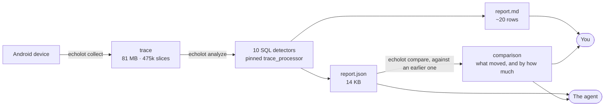

<p align="center">
  <b>Find where Android startup time actually goes — from a Perfetto trace down to a line of code.</b>
</p>

<p align="center">
  <a href="https://github.com/grishan0v/echolot/actions/workflows/checks.yml"></a>
  <a href="https://github.com/grishan0v/echolot/actions/workflows/codeql.yml"></a>
  <a href="https://pypi.org/project/echolot/"></a>
  <a href="https://pypi.org/project/echolot/"></a>
  <a href="https://github.com/grishan0v/echolot/blob/main/LICENSE"></a>
  <a href="#status"></a>
</p>

---

**Contents** · [What it is](#what-it-is) · [Requirements](#requirements) · [Quick start](#quick-start) · [What you get](#what-you-get) · [What changed](#what-changed) · [Commands](#commands) · [Detectors](#detectors) · [How it works](#how-it-works) · [Project layout](#project-layout) · [Documentation](#documentation) · [Status](#status)

---

## What it is

A Perfetto trace of one cold start holds around half a million slices in eighty
megabytes. Nobody reads that, and an AI agent pointed at the raw file produces
confident guesses instead of answers.

echolot sits in between. It runs ten SQL detectors over the trace and returns
about twenty rows: where the time went, how much of it, and the evidence behind
each claim. Same trace in, same report out — the `trace_processor` version is
pinned and verified on every run.

> [!TIP]
> The intended way to use it is through Claude Code: you describe the
> regression in plain words, the agent collects traces, reads the report and
> walks down to the code. The command line works on its own too — see
> [without an agent](#without-an-agent).

**Using Cursor, Codex or something else?** `echolot init` points them at the
tool, and `echolot guide` tells any agent how to work with it. The loop runs
in your main context rather than a subagent, so keep the passes short — the
guide says where that matters.

`echolot reflect` works from any of them: with no transcript to read it builds
the report from the tool's own run log, and names every check it could not
make rather than reporting silence as a clean bill.

## Requirements

| | |
|---|---|
| **Python** | 3.10 or newer |
| **`adb`** | on `PATH` — ships in the Android SDK platform-tools |
| **Device** | a phone or emulator with USB debugging on |
| **Agent** *(optional)* | [Claude Code](https://claude.com/claude-code) for the full workflow; Cursor, Codex and others via `echolot guide` |
| **Android 12+** *(for one detector)* | `frame_jank` reads SurfaceFlinger's frame timeline. Older devices do not have it, and the detector is then silent — which reads exactly like "no bad frames" |

Validated on Android 14 (emulator) and Android 13 (Galaxy A51).

## Quick start

### 1. Install

```bash
pipx install echolot
```

### 2. Set up your project

Run this once inside your Android project:

```bash
cd ~/my-app && echolot init
```

This installs the `.claude/` layer — a skill, the `perf-hunter` agent and three
commands — then checks that this machine computes traces correctly.

### 3. Open the agent and type one word

```
/echolot
```

That is the only entry point you need to remember. It asks the tool where the
project stands and takes the next step by itself:

- **first run** — builds `echolot.yml` from your repository and a probe trace,
  asking you four questions along the way;
- **every run after** — hunts down the regression you describe.

```
/echolot                          reads the state, does whatever is next
/echolot why is cold start slow   hunt, with that as the question
/echolot init | setup | hunt | reflect | doctor
```

### Coming back later

```bash
echolot
```

Prints where the project stands — layer, config, traces, last report, last
`doctor` — and one line saying what to do next.

> [!IMPORTANT]
> After upgrading the package, run `echolot init` again. It brings the
> `.claude/` layer up to date and leaves files you edited alone.

### Without an agent

The same work, by hand or in CI:

```bash
echolot collect -c echolot.yml -n 5                              # 5 repeats of the scenario
echolot analyze .echolot/traces/*.perfetto-trace -c echolot.yml  # build the report
echolot compare before.json .echolot/out/report.json             # what changed since
echolot doctor -q                                                # exit 0/1: is this environment sane?
```

Results land in `.echolot/out/` — `report.md` for you, `report.json` for the
agent.

## What you get

A **Marker Report**: one section per detector that fired, nothing else.

<details>
<summary><b>Example report</b> (click to expand)</summary>

```markdown
# Marker Report

Runs: **5**, numbers are medians across them
Process: `com.example.app` (pid 12903)
Scenario window: **1184 ms** (from 1102 to 1291)
Detectors fired: **5 of 8**

## Where the main thread spent its time

_measured as SELF time, children subtracted_

| Where | N | Self, ms | Total, ms | Max, ms |
|---|---|---|---|---|
| draw | 4 | 125.4 | 130.1 | 61.2 |
| TextLayout:initLayout | 61 | 88.0 | 88.0 | 4.1 |
| inflate | 12 | 47.3 | 210.7 | 12.9 |

## Blind spots: threads burning CPU with no instrumentation

_the only detector that finds a problem inside uninstrumented code_

| Where | Total, ms | Instrumented, ms | Evidence |
|---|---|---|---|
| DefaultDispatcher-worker-2 | 340.2 | 0.0 | 0 slices |

## Monitor contention

| Where | N | Total, ms | Max, ms | Evidence |
|---|---|---|---|---|
| Lock contention on a monitor lock | 9 | 61.5 | 22.4 | owner tid 12931 |

## Frames that missed their deadline

_time past the deadline; frame duration is in the evidence_

| Where | N | Total, ms | Max, ms | Evidence |
|---|---|---|---|---|
| App Deadline Missed | 14 | 412.0 | 70.1 | Self Jank · 14 of 300 frames · longest 86.2 ms |

## Single occurrences far longer than the same work usually takes

| Where | N | Total, ms | Max, ms | Evidence |
|---|---|---|---|---|
| inflate | 2 | 149.3 | 86.2 | median 12.9 ms of 312 · worst 6.7× |

**Silent:** gc_pressure, binder_txn, runnable_starvation
```

</details>

The report is written for two readers at once: `report.md` reads like a
findings list, `report.json` carries the same numbers in a shape the agent can
walk. An 81 MB trace with 475k slices comes out as a 14 KB `report.json` in
about five seconds.

## What changed

The report says where the time went in one set of traces. The question people
arrive with has a second half — *it was 3 s, now it is 7 s* — and that needs
two sets.

```bash
echolot compare                       # inside an investigation: previous round vs latest
echolot compare old.json new.json     # or name them
```

One table, sorted by how far each row moved. The top row is usually the answer.

```markdown
| Where | Detector | Before | After | Δ | N | Ranges |
|---|---|---|---|---|---|---|
| SyncAdapter.onPerformSync | uninstrumented_cpu | — | 1402.0 ±61 | **new** | — → 0 | — |
| TeamRepository.loadAll | main_thread_block | 12.1 ±2 | 883.4 ±40 | **+871.3 ×73** | 1 → 1 | apart |
| inflate | main_thread_block | 47.3 ±31 | 121.9 ±88 | +74.6 ×2.6 | 12 → 31 | overlap |
```

`N` separates "called more often" from "became slower inside" — two different
bugs in two different places. **Ranges** is the column that decides whether a
row is worth acting on: `apart` means every repeat after fell outside
everything seen before, `overlap` means the runs disagree among themselves by
more than the medians moved, and the honest next step is another round of
`collect` rather than a conclusion.

Reports built against different thresholds are compared with the reason printed
above the table — a row can cross a moved bar without anything in the app
changing. See [Comparing](https://github.com/grishan0v/echolot/blob/main/docs/compare.md).

## Commands

Three audiences share one CLI, and `echolot --help` says which is which — the
grouping below is generated from the same registration, so the two cannot
drift apart.

Every argument after `/echolot` is a verb of the same name, doing the same
thing plus whatever loop needs an agent. One word, one meaning, both surfaces.

### Yours

| command | what it does |
|---|---|
| `echolot` | where this project stands, and the next step |
| `echolot init` | install or update the `.claude/` layer; checks the environment |
| `echolot hunt "<what regressed>"` | open an investigation — see [below](#the-investigation) |
| `echolot doctor` | environment + self-check on a synthetic trace; exit 0/1, `-q` for three lines |

### The pipeline — for CI, and for traces by hand

| command | what it does |
|---|---|
| `echolot collect` | capture N traces of one scenario — `launch`, `command` or `gradle` |
| `echolot analyze` | run the detectors, build a Marker Report |
| `echolot compare` | the difference between two reports — see [below](#what-changed) |

<details>
<summary><b>The agent's, behind <code>/echolot</code></b> — you do not call these</summary>

<br>

| command | what it does |
|---|---|
| `guide` | how to work with this tool, printed by the package — what an agent without the `.claude/` layer reads instead of it |
| `anr` | an ANR report from the field — the lock chain, the few threads that were not idle, and where their frames are in this checkout. Crashlytics exports and the device's own `dumpsys dropbox` record |
| `probe` | processes, threads by CPU, scenario anchor candidates |
| `names` | slice name inventory and detector mask coverage |
| `domains` | slice-to-code map and instrumentation coverage |
| `mark` | the first temporary markers for a project with none, from the manifest and the SDK, or from an ANR report's own frames with `--from-anr` — `--apply` / `--remove` |
| `calibrate` | thresholds derived from known-healthy runs |
| `explain` | list the detectors and their parameters |

</details>

<details>
<summary><b>For improving the tool</b></summary>

<br>

| command | what it does |
|---|---|
| `reflect` | the same kind of report, over an agent session — how the tool was used, where it got in the way. Full detail for Claude Code; from anywhere else, built from the run log and honest about what it could not see |

</details>

## The investigation

`.echolot/traces/` and `.echolot/out/report.json` mean "the latest set". An
investigation is the label that says which question that set was recorded for,
so that coming back a week later does not answer a question about scrolling
with cold-start traces.

```bash
echolot hunt "cold start was 3s, now 7s" --since "the tab redesign"
```

That opens one, moves the previous set of traces aside without deleting it,
and says whether the last investigation left temporary markers in your
sources. `echolot hunt` on its own says what is open.

```
echolot hunt --list          every investigation, newest first
echolot hunt --show 2        one of them in full — including where its traces went
echolot hunt --resume        carry on with the open one
echolot hunt --done "..."    record what it came to
```

Each one is numbered, and everything it produces is filed under it: every
round of traces by path, every report as a copy in
`.echolot/hunts/<n>/reports/`. So a question asked three weeks ago still knows
what was measured to answer it, and what each round concluded on the way.

Nothing moves to make this work — `collect` still writes to `.echolot/traces/`
and the latest report is still `.echolot/out/report.json`, so every example
above and any CI job keep working unchanged.

You rarely type any of it. `/echolot` reads the state and, when an
investigation has been sitting untouched with traces behind it, asks whether
to carry on or start something new — and never asks inside the hunting loop,
which re-records and re-instruments on purpose.

## Detectors

| detector | what it catches |
|---|---|
| `main_thread_block` | where the main thread spent its time, by self time |
| `gc_pressure` | frequent or expensive GC, and waits on allocation |
| `monitor_contention` | lock contention, with the owner's tid as evidence |
| `binder_txn` | long synchronous IPC, and death by a thousand cuts |
| `runnable_starvation` | thread ready to run but preempted on CPU |
| `uninstrumented_cpu` | **threads burning CPU with no instrumentation** |
| `frame_jank` | frames that missed their deadline, and whose fault it was |
| `anr_risk` | stretches where the main thread never got back to the message queue |
| `anr` | ANRs the system recorded during the trace, with its own reason |
| `main_thread_outlier` | one occurrence far longer than that work usually takes |

Two of them find something where nobody wrote a `trace{}` call.

`uninstrumented_cpu` does not guess — it states a fact:

> thread `DefaultDispatcher-worker-2` was Running for 340 ms, zero slices

Which is exactly where to add `trace{}` and record again.

`frame_jank` needs no instrumentation at all: SurfaceFlinger records every
frame's deadline and what it actually took, and says whose fault a miss was.
Android 12 and up — see [requirements](#requirements).

`main_thread_block` and `main_thread_outlier` are a pair, and reading one as
the other wastes a round. The first gates on the **sum** for a name and answers
"where did the time go". The second gates on a **single occurrence** against
the median for that same name and answers "which one was out of line". A name
can appear in both, saying different things — and they lead to different
places: expensive every time means the fix is in that work, usually fine and
once not means the cause is the state it hit that once.

> [!NOTE]
> Each detector is one self-contained `.sql` file with its metadata in the
> header. Drop a file into `echolot/sql/detectors/` and it is picked up —
> there is no registration step in code. See
> [docs/detectors.md](https://github.com/grishan0v/echolot/blob/main/docs/detectors.md).

## How it works



## Project layout

```
android-project/
├── echolot.yml       ← the project half, committed
├── local.yml         ← device serials, binary path; in .gitignore
└── .echolot/         ← traces, reports, run log, reflect reports; in .gitignore
```

Read it the way you read `gradle.properties` and `local.properties`: one tool
per machine, and the binding to a project living inside that project's
repository.

## Documentation

Start at the [documentation index](https://github.com/grishan0v/echolot/tree/main/docs), or jump straight in:

| | document | about |
|---|---|---|
| 🎬 | [Collecting](https://github.com/grishan0v/echolot/blob/main/docs/collecting.md) | `collect`, the three modes, merging repeats |
| 🔎 | [Analysing](https://github.com/grishan0v/echolot/blob/main/docs/analysing.md) | `probe`, `names`, `domains` — from a trace to a place in the code |
| 🔀 | [Comparing](https://github.com/grishan0v/echolot/blob/main/docs/compare.md) | `compare` — what changed between two reports, and when the repeats support saying so |
| 🧊 | [ANRs](https://github.com/grishan0v/echolot/blob/main/docs/anr.md) | `anr` — reading a report from the field, and measuring a freeze |
| 🏷️ | [Marking](https://github.com/grishan0v/echolot/blob/main/docs/mark.md) | `mark` — first markers for a project with no instrumentation |
| ⚙️ | [Detectors](https://github.com/grishan0v/echolot/blob/main/docs/detectors.md) | writing your own, the context views, self time versus total |
| 📏 | [Calibrating](https://github.com/grishan0v/echolot/blob/main/docs/calibrate.md) | thresholds from healthy runs, why rank beats percentile |
| 🔒 | [Determinism](https://github.com/grishan0v/echolot/blob/main/docs/determinism.md) | the pinned `trace_processor`, `doctor`, the self-check |
| 🤖 | [The agent layer](https://github.com/grishan0v/echolot/blob/main/docs/agent-layer.md) | the `.claude/` layer, and why the loop lives in a subagent |
| 🪞 | [Reflect](https://github.com/grishan0v/echolot/blob/main/docs/reflect.md) | the report over an agent session, for improving the tool |

Agent-facing reference material ships inside the package under
`echolot/claude/skills/echolot/references/` — the report schema, the config
schema, how ART names things, and how to capture a trace by hand.

## Status

**v0.** Everything planned for it is in place.

The detectors were validated against a synthetic trace — 88 checks inside
`doctor`, one per claim — and against live traces from Android 14 (emulator) and Android 13
(Galaxy A51). The naming masks for GC, locks and binder were narrowed against
those real traces, and every narrowing is pinned by a check.

Two are newer than that hardware round and have not had one. `frame_jank` was
built against the pinned `trace_processor` and a frame timeline written for the
purpose — the column names, the jank vocabulary and where display frames live
were all read back out of it rather than assumed — but no report from it has
been compared with a real device's own frame statistics yet.
`main_thread_outlier` was written for a miss recorded on an A51 and has so far
answered only the fixture.

A failed detector never fails the run: the error goes to stderr and into
`report.json`.

### Working on the tool

```bash
pip install -e '.[dev]'
pytest                       # every check, including the ones doctor runs
pytest -k uninstrumented     # one detector's claims, by name
```

`doctor` stays dependency-free: it walks the same list itself, because it runs
on a user's laptop where pytest is not installed.

### There is no CI gate, on purpose

An earlier plan had `analyze` exit non-zero against `scenario.budget_ms`, so a
build could fail on a slow run. It is not being built, and this is the reason.

"Did it get slower" is already answered. Macrobenchmark writes percentiles per
iteration right next to the traces echolot collects from it, and comparing a
median against a number is a few lines of anything. An eleventh implementation
of that adds nothing. Worse, detector thresholds on a shared CI runner would
fire on properties of the runner — the same caution this tool already gives
about `runnable_starvation` on a loaded machine.

Where echolot is hard to replace is the other question: *where* the time went.
So the useful shape in CI is the opposite of a gate. Run `echolot doctor -q` as
a precondition — it already answers "does this machine compute correctly" with
an exit code — then `analyze` over the traces the benchmark has already
written, `compare` against yesterday's report, and keep both JSON files as
build artefacts. When someone asks a day later why the nightly regressed, the
window, the thresholds, the evidence and the delta are already sitting next to
the commit: no device, no re-recording.

`compare` exits 0 whatever it finds, for the same reason. It reports; it does
not stand guard.

`scenario.budget_ms` stays in the config. It records what a team considers
acceptable, which is worth writing down whether or not anything enforces it.

## License

[Apache 2.0](https://github.com/grishan0v/echolot/blob/main/LICENSE)
